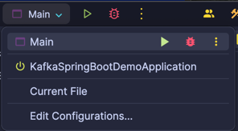

# Sample Kafka and Spring Boot project

This project is intended for demonstrating requirements
for the Kafka course to be delivered in the last week of March.

Below is a checklist of what we are looking for:

- [ ] Run the Docker Compose to set up Kafka locally with local Docker
- [ ] Import sample code into IntelliJ or IDE of choice at Companies House
- [ ] Download the necessary maven dependencies
- [ ] Run the sample Kafka example project with no issues
- [ ] Run the sample Spring Boot application with no issues
- [ ] Report back any issues with the setup

## Requirements

The following are mandatory requirements:

- JDK 17 or 21 installed
- Maven 3.9.0 or newer
- Docker desktop or FOSS equivalent such as Portainer
    - Must be able to run `docker compose` commands
- IntelliJ or any IDE/text-editor that can import a maven project
- Ports 9092, 9091 and 8081 available

## Running the applications

First, we must get Kafka up and running. In a console/terminal, run:

```shell
docker compose up -d`
```

Edit the root [pom.xml](pom.xml) to make sure the JDK version in the properties
section is what you have. I have defaulted to JDK 21, change for JDK 17.

Load the application into your IDE. If you are using IntelliJ, you should
be able to see pre-configured run configurations that you can use to run
the applications instead of using maven in the command line:



Feel free to run the applications through the IDE. You can also run the command lines
below.

Download the dependencies:

```shell
mvn install
```

Run the kafka example project:

```shell
mvn compile exec:java -Dexec.mainClass=io.example.Main -pl kafka-example
```

Don't worry that messages appear "out of order", we will why in the class.

Run the SpringBoot application

```shell
mvn spring-boot:run -pl spring-boot-example
```

If everything works, then congratulations, you have all the requirements
for the course.